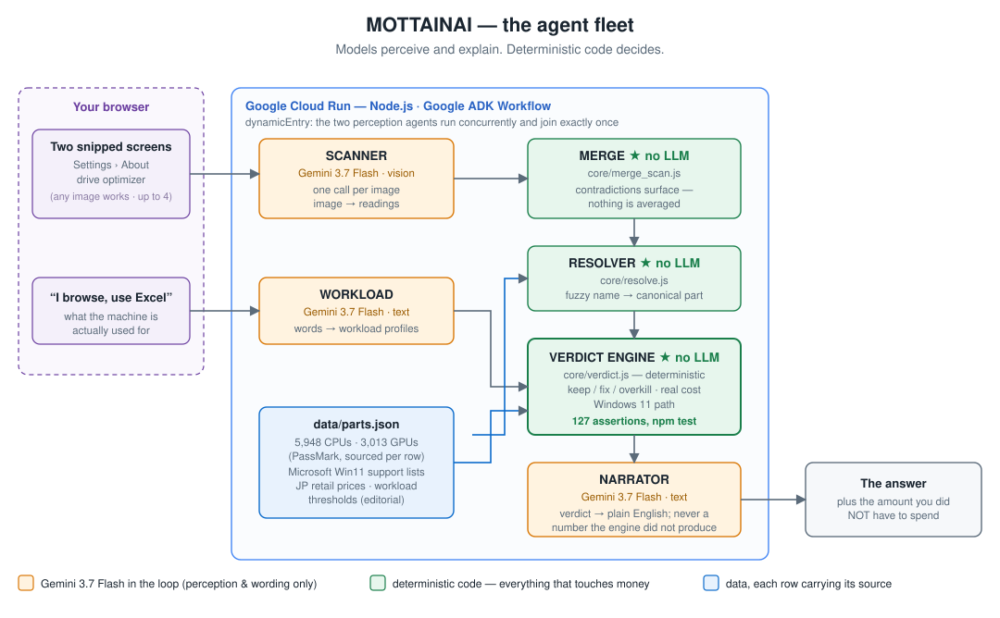

# MOTTAINAI — Architecture

> The agent fleet that tries to talk you out of buying a new PC.

## The one design rule

**LLMs perceive and explain. Deterministic code decides.**

Every verdict that touches the user's money is computed by `core/verdict.js` — plain,
readable, testable code with no model in the loop. The language models are confined to
two jobs they are actually good at: reading an image, and putting a result into words.

This is not a stylistic preference. A tool whose entire promise is *"you don't need to
spend that money"* cannot afford a hallucinated number. If the verdict engine says
"keep your CPU", that sentence is reproducible, inspectable, and unit-tested
(`npm test` — 127 assertions today).

## Why the agents run in the background

A person asking "should I replace this PC?" does not want a chat session. They want to
hand over a couple of screenshots and get an answer. So the work fans out the moment the
images land, and the user watches the fleet report in rather than answering follow-up
questions.

The two perception legs are independent of each other — what the hardware *is* and what
the machine is *used for* — so they run concurrently, and each image is read by its own
model call. Everything downstream of perception is ordinary code.

## The fleet



The same flow as text:

```
              screenshots / photos (up to 4)      "I just browse and use Excel"
                              │                                  │
                              ▼                                  ▼
                   ┌──────────────────┐              ┌──────────────────────┐
                   │  SCANNER agent   │              │   WORKLOAD agent     │
                   │  (Gemini vision) │              │   (Gemini text)      │
                   │  one call/image  │              │   words → profiles   │
                   └────────┬─────────┘              └──────────┬───────────┘
                            │ one reading per image             │ workload ids
                            ▼                                   │
                   ┌──────────────────┐                         │
                   │  MERGE           │  ★ no LLM ★             │
                   │  core/merge_scan │  contradictions surface;│
                   │                  │  nothing is averaged    │
                   └────────┬─────────┘                         │
                            ▼                                   │
                   ┌──────────────────┐                         │
                   │  RESOLVER        │  ★ no LLM ★             │
                   │  name → canonical│                         │
                   │  + benchmark data│                         │
                   └────────┬─────────┘                         │
                            └─────────────┬─────────────────────┘
                                          ▼
                             ┌──────────────────────────┐
                             │   VERDICT ENGINE         │
                             │   ★ no LLM ★             │
                             │   core/verdict.js        │
                             │   deterministic, tested  │
                             └────────────┬─────────────┘
                                          │  keep / fix / overkill
                                          ▼
                                ┌──────────────────┐
                                │  NARRATOR agent  │
                                │  (Gemini text)   │
                                │  verdict → plain │
                                │  English         │
                                └────────┬─────────┘
                                         ▼
                                 the answer, plus the
                                 amount you did NOT
                                 have to spend
```

A note on the graph: ADK's static `edges` fire a downstream node once per incoming edge,
so wiring `scan` and `workload` straight into the join would run it twice. The workflow
uses `dynamicEntry` instead, which runs the two perception agents concurrently and joins
exactly once. If narration fails, the verdict ships without it — the decoration never
takes the decision down with it.

## What each agent is responsible for

| Agent | Model in loop | Job | Fails safely by |
|---|---|---|---|
| **Scanner** | Gemini (vision) | Read a Windows screenshot, a photo of the inside of a PC, or a spec sheet, and name the components — one call per image | Asking for the one field it could not read, instead of guessing |
| **Workload** | Gemini (text) | Turn "I just browse and use Excel" into workload profiles | Defaulting to the *lighter* profile when ambiguous — an under-estimate costs the user nothing, an over-estimate sells them hardware |
| **Merge** | **none — by design** | Reconcile the per-image readings into one machine | Surfacing contradictions (a size mismatch means a different drive) instead of averaging or picking a winner |
| **Resolver** | none | Map a fuzzy part name to a canonical entry with a benchmark score | Marking the part unknown rather than substituting a similar one |
| **Verdict** | **none — by design** | Decide keep / fix / overkill per component, compute the real cost | It cannot hallucinate; it is ordinary code with tests |
| **Narrator** | Gemini (text) | Explain the finished verdict in plain English | Never introducing a number the engine did not produce; if it fails, the verdict ships without it |

## The direction the output points

Every other configurator in this space resolves *upward*: pick a use case, receive a
build, and the more expensive the build the more the site earns. Searching the existing
tools (both Japanese and English) turns up no exception — every one of them is a
shopping funnel.

MOTTAINAI resolves *downward*. It looks for the cheapest true answer, and the outcome it
is most pleased to reach is **¥0**. The four-state verdict exists for the same reason:
separating "enough" from "far more than enough" tells a person not just what to do now,
but that they were oversold last time.

## Repository layout

```
core/          the judgment engine — no network, no model, fully testable
  workloads.js   what each use actually requires, and where it stops mattering
  verdict.js     keep / fix / overkill, cost, Windows 11 path
  merge_scan.js  reconciles readings from multiple images; disagreements surface
  resolve.js     fuzzy part name → canonical entry with benchmark data
  selftest.js    127 assertions over the logic above
data/          benchmark and requirement data, each row carrying its source
agents/        the model-facing layer
server/        HTTP surface, deployed to Google Cloud Run
web/           the interface
```

## Google stack

- **Gemini** — vision for the scanner, text for the workload and narrator agents
- **Agent framework** — the fleet is defined and orchestrated with a Google agent framework
- **Cloud Run** — the backend the video demonstrates running

*(exact model ids, SDK package names and deploy commands are pinned in `STACK.md`,
written from the official docs rather than from memory, since model names in this
family are retired and renamed regularly)*
